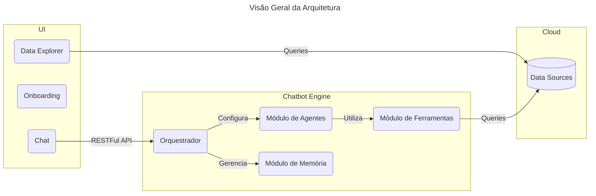

# Chatbot para Análise de Dados

Esse repositório contém a implementação de um chatbot utilizando [Langchain](https://github.com/langchain-ai/langchain), [Streamlit](https://streamlit.io/), e [FastAPI](https://fastapi.tiangolo.com/), com o intuito de facilitar análise dados de diferentes fontes, com diferentes formatos, permitindo a exploração e resposta à perguntas simples. 

## Quickstart

TODO

## Arquitetura do Sistema

O sistema é organizado seguindo uma arquitetura baseada em serviços, permitindo que diferentes componentes do sistema possam melhor definir suas necessidades arquiteturais. O diagrama abaixo possui uma visão geral desses serviços e da UI unificada. 

- `UI`: interface gráfica implementada como um dashboard usando Streamlit;
- `Chatbot Engie`: motor do chatbot, internamente utiliza LLMs e outras técnicas;
    - `Orquestrador`: componente responsável por organizar os agentes e suas estruturas de memórias;
        - Não necessariamente reflete um componente "tangível" no código (e.g., classe/entidade);
        - É o componente responsável por garantir que partes distintas do sistema se integrem (e.g., múltiplos agentes e estruturas de memória);
    - `Módulo de Agentes`: contém a definição de diferentes _agentes_ do sistema;
    - `Módulo de Ferramentas`: contém a definição das _ações_ que agentes podem tomar no sistema (e.g., busca por dados/contexto, interação com os conjuntos de dados);
    - `Módulo de memória`: organização da estrutura de memória para agentes (e.g., sessões, históricos, contextos);
- `Cloud`: fontes externas de dados, nesse contexto representado por dados na Cloud;
    - O sistema interage com tais fontes única e exclusivamente através de queries;
    - Por simplicidade, atualização nessas fontes não é permitido por nenhum componente do sistema;

## Estrutura do Repositório

TODO

## Considerações de Segurança

- Por ser um sistema de análise, se supõe uma ferramenta de uso interno, dessa forma proteções contra SQL Injection foram simplificadas;
    - Em um cenário onde tais premissas não são verdadeiras, é importante seguir as recomendações de segurança (e.g., [OWASP SQL Injection Prevention](cheatsheetseries.owasp.org/cheatsheets/SQL_Injection_Prevention_Cheat_Sheet.html));
