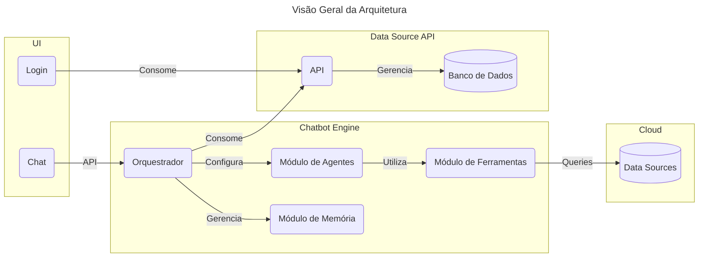
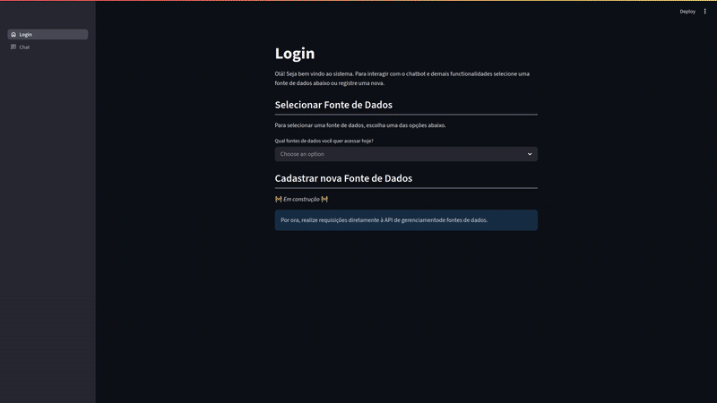
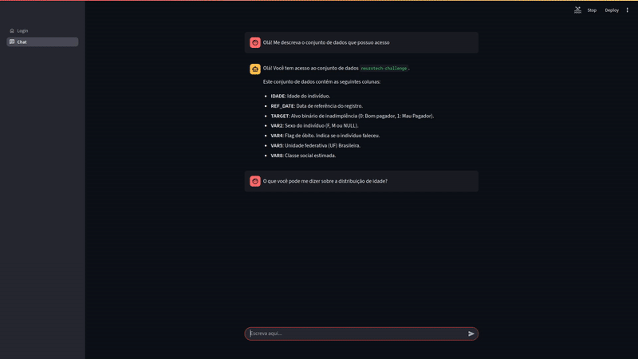

# Chatbot para Análise de Dados

Esse repositório contém a implementação de um chatbot utilizando [Langchain](https://github.com/langchain-ai/langchain), [Streamlit](https://streamlit.io/), e [FastAPI](https://fastapi.tiangolo.com/), com o intuito de facilitar análise dados de diferentes fontes, com diferentes formatos, permitindo a exploração e resposta à perguntas simples.

## Quickstart

Para testar localmente, basta utilizar o comando `make`. O arquivo `Makefile` contém a definição das tarefas necessárias para execução com Docker. A configuração padrão utiliza o [`gemini-2.5-flash`](https://ai.google.dev/gemini-api/docs/api-key), sendo necessário adicionar um arquivo `.env` com o `GOOGLE_API_KEY`. É necessário possuir Python na máquina host com suporte à biblioteca `requests` (utilizada para popular as fontes de dados executando [`populate_sources.py`](./populate_sources.py)).

É possível trocar o modelo e provedor diretamente no `docker-compose.yaml` através das variáveis de ambiente. Para facilitar execução local, o sistema também levanta uma instância do [`ollama`](https://hub.docker.com/r/ollama/ollama). O `Makefile` possui um exemplo de como baixar modelos no container.

Uma vez que o sistema esteja disponível, as seguintes APIs estão disponíveis:

- `Dashboard`: [`localhost:8081`](http://localhost:8081), dashboard para o chatbot;
- `Chatbot API`: [`localhost:8082/docs`](http://localhost:8082/docs), API para comunicação com o chatbot;
- `Data Source API`: [`localhost:8083/docs`](http://localhost:8083/docs), API para gerenciamento das fontes de dados;

## Arquitetura do Sistema

O sistema é organizado seguindo uma arquitetura baseada em serviços, permitindo que diferentes componentes do sistema possam melhor definir suas necessidades arquiteturais. O diagrama abaixo possui uma visão geral desses serviços e da UI unificada. 

- `UI`: interface gráfica implementada como um dashboard usando Streamlit;
- `Data Source API`: gerenciador de fontes de dados disponíveis para análise;
    - Armazena metadados sobre as fontes de dados;
    - Organiza identificadores únicos para fontes de dados;
- `Chatbot Engine`: motor do chatbot, internamente utiliza LLMs e outras técnicas;
    - `Orquestrador`: componente responsável por organizar os agentes e suas estruturas de memórias;
        - Não necessariamente reflete um componente "tangível" no código (e.g., classe/entidade);
        - É o componente responsável por garantir que partes distintas do sistema se integrem (e.g., agentes, memória);
    - `Módulo de Agentes`: contém a definição de diferentes _agentes_ do sistema;
    - `Módulo de Ferramentas`: contém a definição das _ações_ que agentes podem tomar no sistema (e.g., busca por dados/contexto, interação com os conjuntos de dados);
    - `Módulo de memória`: organização da estrutura de memória para agentes (e.g., sessões, históricos, contextos);
- `Cloud`: fontes externas de dados, nesse contexto representado por dados na Cloud;
    - O sistema interage com tais fontes única e exclusivamente através de queries;
    - Por simplicidade, atualização nessas fontes não é permitido por nenhum componente do sistema;

O sistema é arquitetado para ser utilizado para múltiplas fontes distintas de dados, que devem ser previamente cadastradas via API, cujas conexões são suportadas. De maneira geral, o principal fluxo do sistema é o seguinte:

1. Usuário acessa à UI e é redirecionado para o módulo de login;
2. O módulo de login permite ao usuário cadastrar uma nova fonte de dados ou se conectar à uma já existente no sistema;
    - Esse módulo se comunica diretamente com a API de fontes de dados;
3. Uma vez que o usuário tenha selecionado a fonte de dados que vai trabalhar, a UI libera o acesso para os módulos de `Chatbot` e `Explorer`;
4. Caso o usuário deseje visualizar os dados de formais _mais clássica_ com uma descrição da fonte de dados, estatística descritiva e outras visualizações pré-definidas, basta acessar a aba `Explorer`;
    - Essa aba implementa o fluxo clássico de exploração de dados;
    - Essencialmente, é uma descrição da fonte dados que o usuário está conectado;
    - Consome a API de fonte de dados para obter informações sobre schema, método de conexão, entre outros;
5. Caso o usuário deseje explorar a fonte de dados através de linguagem natural, basta acessar a aba `Chatbot`;
    - Essa aba se comunica com a API do Chatbot, permitindo que perguntas de linguagem natural sejam convertidas em explorações nas fontes de dados;
    - O processamento ocorre de forma síncrona usando _streams_;
        - Uma alternativa para escalabilidade seria utilizar processamento assíncrono utilizando tecnologias como RabbitMQ ou Kafka;
    - Internamente, a API mantém sessões/histórico para as diferentes fontes de dados (deve ser informado como parte da requisição);
    - Só é possível consumir a API em uma fonte de dados cadastrada no sistema;

## Considerações & Premissas

- Por ser um sistema de análise, se supõe uma ferramenta de uso interno, dessa forma proteções contra SQL Injection foram simplificadas;
    - Em um cenário onde tais premissas não são verdadeiras, é importante seguir as recomendações de segurança (e.g., [OWASP SQL Injection Prevention](https://cheatsheetseries.owasp.org/cheatsheets/SQL_Injection_Prevention_Cheat_Sheet.html));
- Por simplicidade, não foram implementados os métodos para deleção de uma fonte dados;
    - Na prática, seria necessário que a API de fonte dados enviasse um _post_ para algum callback do Chatbot, permitindo que a memória relacionada com tal banco fosse removida;
- Para melhoria de performance e melhor UX, a API do Chatbot deveria retornar uma resposta em formato de _streaming_;
    - Para facilitar a implementação, só consideramos o caso de uso do `.invoke(...)` (para `.stream(...)` são necessárias algumas checagens para adequação ao modo);
- Apenas o caso de fontes de dados em storages `S3`-compatible foram implementadas;
    - A interface `Connector` permite que seja simples expandir para outras fontes (e.g., Cloud SQL, RDS/Aurora, Redshift); 
- A persistência do histórico de mensagens não foi implementada;
    - O ideal seria utilizar as facilidades do `langchain` para memória de longo termo;
    - Além disso, seriam necessárias novas rotas na API para permitir a recuperação do histórico (e.g., paginação, filtros, etc);
 

## Showcase

> [!NOTE]
> 
> Para uma demonstração mais longa, acesse o [vídeo de showcase](.github/showcase.mkv).

